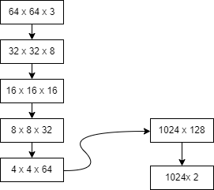

Gender classifer with simple architecture
==============================

GenderNet is a classifier with simple architecture for classifying gender wether man or woman. with this architecture managed to achieve 80% accuracy for training and 80% accuracy for testing.

--------

<small>Project based on the <a target="_blank" href="https://drivendata.github.io/cookiecutter-data-science/">cookiecutter data science project template</a>. #cookiecutterdatascience</small>

